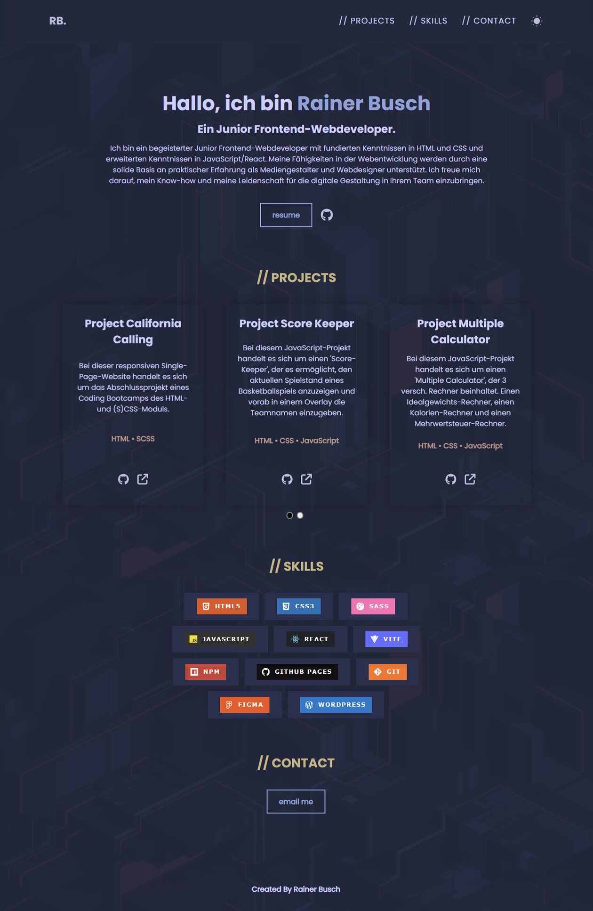
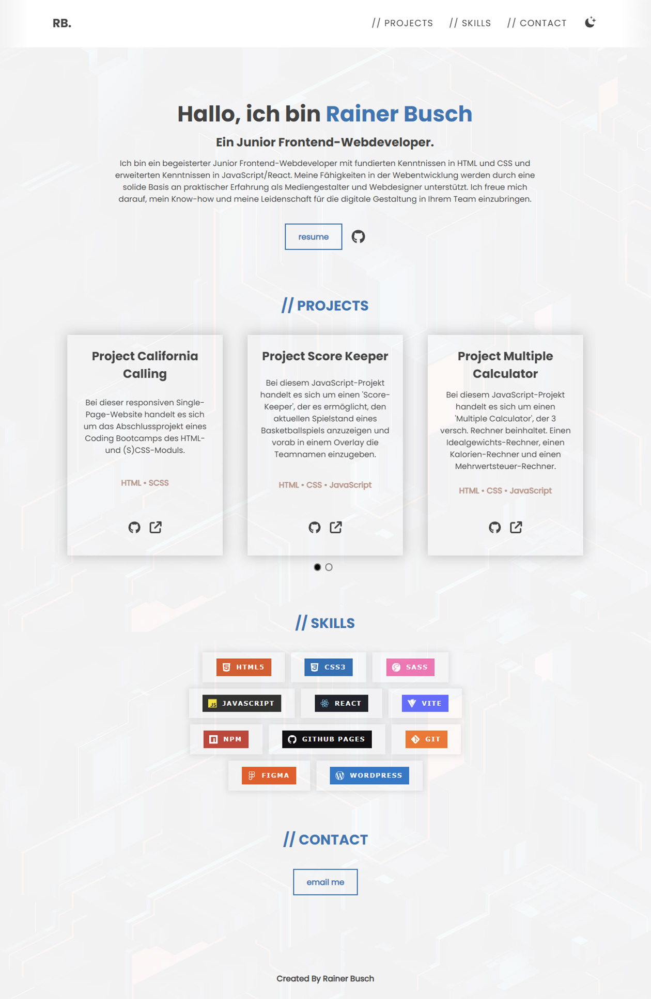
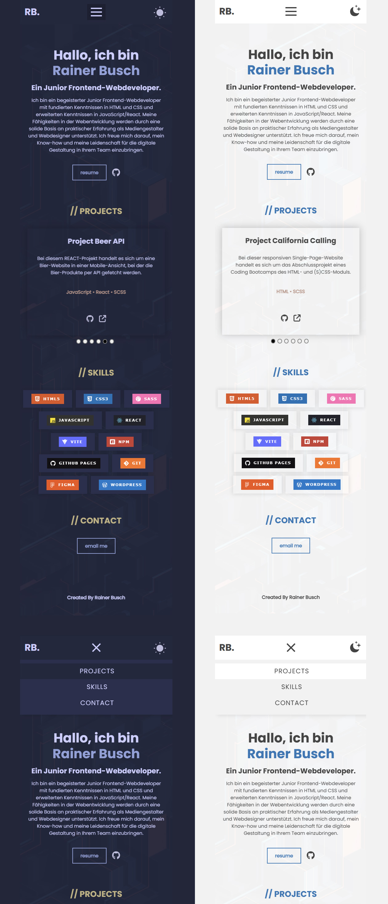

# Rainer Busch // Portfolio

## Beschreibung

Bei diesem React Projekt handelt es sich um meine Portfolio-Seite, welche als Bewerbungs-Website dient.
Aktuell befinden sich 6 ausgewählte Projekte im Bereich "Projects", die während einer WordPress-Weiterbildung und eines Coding-Bootcamps erstellt und im Anschluss von mir weiterentwickelt und optimiert wurden. Die Reihenfolge der Projekte ist chronologisch sortiert und zeigen den absolvierten Weiterbildungsverlauf. Über die GitHub-Icons gelangt man zu den jeweiligen Repositorys der Projekte und über die Forwarding-Icons gelangt man zu den Projekten, die entweder auf GitHub oder auf Netlify veröffentlicht wurden.
Eine Ausnahme bildet hier das WordPress-Projekt, welches auf Strato gehostet ist.

Über den "resume"-Button gelangt man zu meinem Lebenslauf, wo man sich über meine bisherige berufliche Laufbahn und absolvierten Weiterbildungen informieren kann.

## Tools/Technologien

- HTML5
- SCSS
- React
- Vite

***

## Screenshots

### Screenshot Darkmode

### Screenshot Lightmode

### Screenshot Light-/Darkmode Mobile

***

## Netlify Live Vorschau

Du findest eine Live Vorschau auf Netlify: [Netlify Live Vorschau](https://rainer-busch.netlify.app/)

## GitHub Repository

Du findest das gesamte Projekt auf GitHub: [GitHub Repository](https://github.com/w1tch3r-code/rainer_busch_portfolio)

## Anmerkungen

- Diese Seite wird in Zukunft weiterentwickelt und es werden weitere Projekte hinzugefügt.
- Die README.md-Datei dient auch als Bewerbungsunterlage und präsentiert meine Fähigkeiten in der Webentwicklung.
